# Documentation of project 1

## STEP 1

#### Install Apache using Ubuntu’s package manager ‘apt’

<!--Apache HTTP Server  an open source web server software available for free. It runs on 67% of all webservers in the world. It is fast, reliable, and secure. It can be highly customized to meet the needs of many different environments by using extensions and modules.-->

*Update a list of packages in package manager*

``` bash
sudo apt update
```
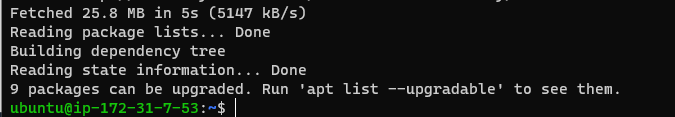


*Run apache2 package installation  verify that apache2 is running as a Service in our OS*
```bash
sudo apt install apache2
sudo systemctl status apache2
```


*Access apache server locally in ubuntu shell*

```bash
curl http://localhost:80
```
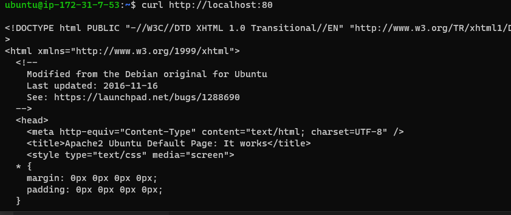

*Apache server on web*


---

## Step 2

### Installing MY-SQL

*Installed mysql-server*

```
sudo apt install mysql-server
```

*log in to the MySQL console*
```bash 
sudo mysql
```
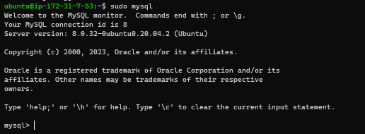

*Define new password*
```bash
ALTER USER 'root'@'localhost' IDENTIFIED WITH mysql_native_password BY 'PassWord.1';
```
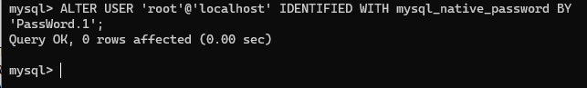

*set password with validation*

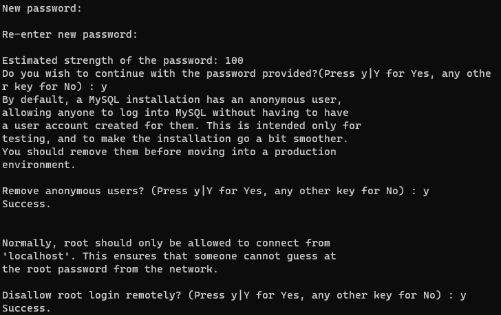


## STEP 3

### Installing PHP
 In addition to the php package, you’ll need php-mysql, a PHP module that allows PHP to communicate with MySQL-based databases. You’ll also need libapache2-mod-php to enable Apache to handle PHP files. Core PHP packages will automatically be installed as dependencies.

 *Installing php with deendencies*

```
sudo apt install php libapache2-mod-php php-mysql
```

 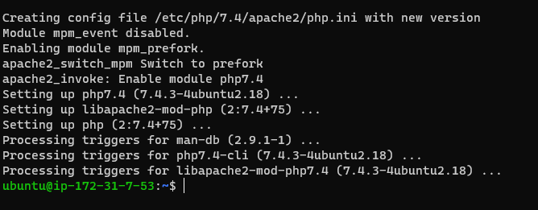

*check php version*

```
php -v

```
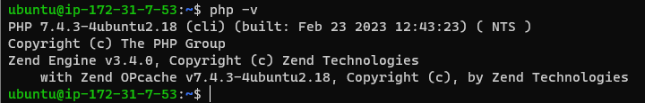

---

## STEP 4

### CREATING A VIRTUAL HOST FOR YOUR WEBSITE USING APACHE

*Create the directory for projectlamp  domain and assign ownership to user*
```
sudo mkdir /var/www/projectlamp
sudo chown -R $USER:$USER /var/www/projectlamp
```
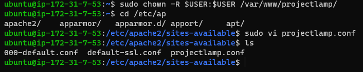

*create and open a new configuration file in Apache’s sites-available directory*

```
sudo vi /etc/apache2/sites-available/projectlamp.conf
<VirtualHost *:80>
    ServerName projectlamp
    ServerAlias www.projectlamp 
    ServerAdmin webmaster@localhost
    DocumentRoot /var/www/projectlamp
    ErrorLog ${APACHE_LOG_DIR}/error.log
    CustomLog ${APACHE_LOG_DIR}/access.log combined
</VirtualHost>
```
With this VirtualHost configuration, we’re telling Apache to serve projectlamp using /var/www/projectlampl as its web root directory. 

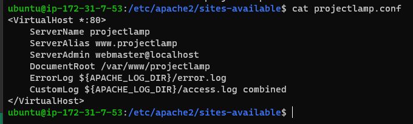


*You can now use a2ensite command to enable the new virtual host:*

```
sudo a2ensite projectlamp

```

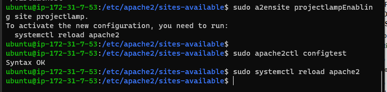


You might want to disable the default website that comes installed with Apache. This is required if you’re not using a custom domain name, because in this case Apache’s default configuration would overwrite your virtual host. To disable Apache’s default website use a2dissite command , type:


*Create an index.html file in that location so that we can test that the virtual host works as expected:*
```
sudo a2dissite 000-default
sudo echo 'Hello LAMP from hostname' $(curl -s http://169.254.169.254/latest/meta-data/public-hostname) 'with public IP' $(curl -s http://169.254.169.254/latest/meta-data/public-ipv4) > /var/www/projectlamp/index.html

```
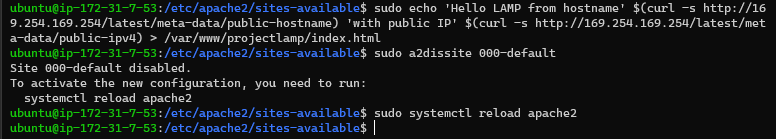

  *open your website URL using DNS Name in browser:*


---

## STEP 5

### ENABLE PHP ON THE WEBSITE

With the default DirectoryIndex settings on Apache, a file named index.html will always take precedence over an index.php file. This is useful for setting up maintenance pages in PHP applications, by creating a temporary index.html file containing an informative message to visitors. Because this page will take precedence over the index.php page, it will then become the landing page for the application. Once maintenance is over, the index.html is renamed or removed from the document root, bringing back the regular application page.


*change the order in which the index.php file is listed*

```
sudo vim /etc/apache2/mods-enabled/dir.conf
```
```HTML
<IfModule mod_dir.c>
        #Change this:
        #DirectoryIndex index.html index.cgi index.pl index.php index.xhtml index.htm
        #To this:
        DirectoryIndex index.php index.html index.cgi index.pl index.xhtml index.htm
</IfModule>

```
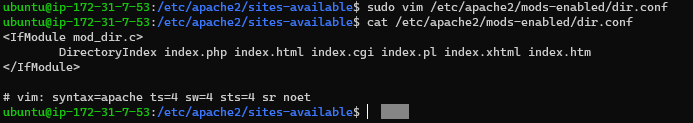


*reload the apache server*

```
sudo systemctl reload apache2
```

*Create a new file named index.php inside your custom web root folder:*

```
vim /var/www/projectlamp/index.php
```

This will open a blank file. Add the following text, which is valid PHP code, inside the file:
```
<?php
phpinfo();
```
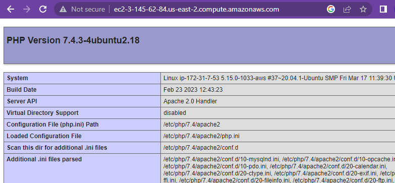